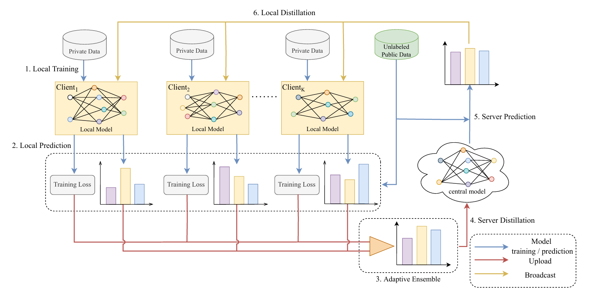

# AdaFD
This repository contains an implementation with PyTorch for the paper "**Adaptive Federated Distillation for Multi-Domain Non-IID Textual Data**". The figure below showes an overview of the proposed federated distillation framework of AdaFD.
<p align="center">

</p>
For more details about the technical details of FedID, please refer to our paper.

### Installation
Run command below to install the environment (using python3):
```
pip install -r requirements.txt
```

### Download Dataset


### Usage
1. Modify the paths in `adafd.sh` to match your local environment.
2. Run the script:
```
bash adafd.sh
```
